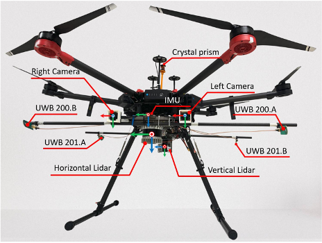
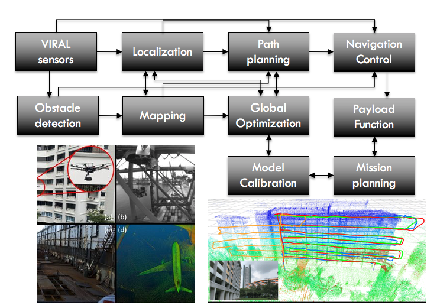

In collaboration with the Building and Construction Authority (BCA), TÜV SÜD Singapore, Xjera Labs, and IHPC. I designed the onboard sensor suite, set up the hardware and software systems, and developed the path-planning algorithm for autonomous inspection. The project was covered by Open Innovation Network as a [success story](https://www.openinnovationnetwork.gov.sg/success-stories/success-stories/smart-drones-a-game-changer-for-building-facade-inspection).

<!-- Recommended citation: Your Name, You. (2010). "Paper Title Number 2." <i>Journal 1</i>. 1(2). -->