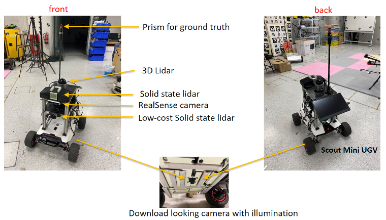

In collaboration with Delta Electronics Inc. I led a team of 2 research fellows and 2 research assistants to develop solutions for autonomous robot planning in multi-level buildings and dense human crowds.

Robot platform:

Experiments in NTU:

Simulations:

<!-- Recommended citation: Your Name, You. (2010). "Paper Title Number 2." <i>Journal 1</i>. 1(2). -->